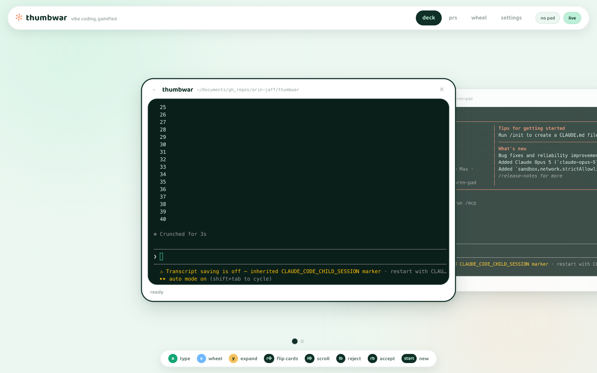
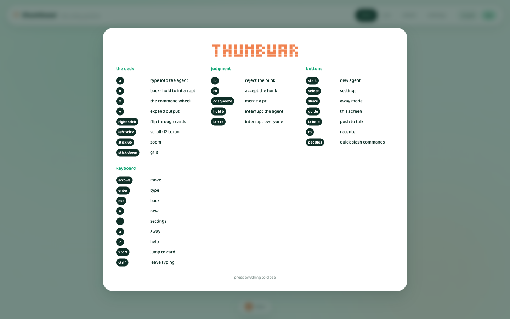
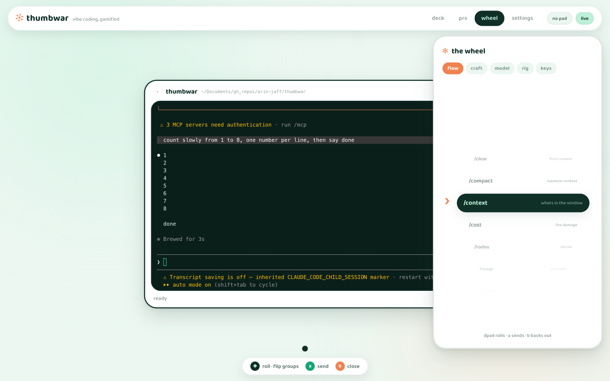
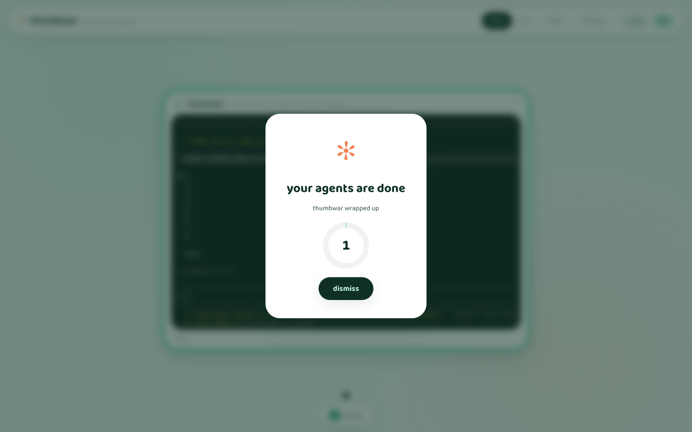

# thumbwar

```
 ✻  ▀█▀ █ █ █ █ █▄█ █▀▄ █ █ █▀█ █▀▄
     █  █▀█ █ █ █ █ █▀▄ █▄█ █▀█ █▀▄
     ▀  ▀ ▀ ▀▀▀ ▀ ▀ ▀▀  ▀▀▀ ▀ ▀ ▀ ▀
```

vibe coding, gamified.

a spatial cockpit for running claude code agents in parallel, designed for a
game controller first and a keyboard second. your sessions are a carousel of
glossy cards, every claude code menu is on a rolling wheel, hunks get judged
with the shoulder buttons, prs merge with a squeeze of the trigger, and when
your agents finish while you are off shopping or on zwift, a floating
disclaimer counts you back in.

built on [ornn-pad](https://github.com/arin-jaff/ornn-pad), a raw hid driver
for the 8bitdo ultimate 2 wireless. any standard gamepad works too through the
browser gamepad api, and everything has a keyboard path.



## quick start

```bash
pip install 'thumbwar[pad] @ git+https://github.com/arin-jaff/thumbwar'
thumbwar
```

no pad handy? plain `pip install` and drive it with the keyboard, or plug in
any gamepad the browser recognizes.

sessions are real ptys. if tmux is installed they are wrapped in
`tmux new -A`, survive server restarts, and you can adopt sessions you
started elsewhere. without tmux everything still works, sessions just live
and die with the server.

## the controls

| input | in the deck |
|---|---|
| right stick | flip through your agents |
| left stick | scroll the terminal, l2 for turbo |
| stick up / down | zoom one card, or the grid of all of them |
| a | start typing into the agent, then a sends enter |
| b | back. hold it to interrupt the agent |
| x | the command wheel |
| y | expand output, ctrl o |
| lb / rb | reject / accept the hunk claude is asking about |
| dpad | left and right hop cards, up and down open the wheel. while typing the whole dpad becomes arrow keys, so claude's own menus are fully driveable |
| l3 hold | push to talk, wired to wispr flow |
| r3 | recenter. with l3 held it interrupts every agent |
| start / select | new agent / settings |
| share | away mode, aka the dismiss button |
| guide | the controller map |
| paddles | quick slash commands, yours to configure |

press guide (or `?`) for the whole map, any time.



the wheel rolls with the dpad through every claude code slash command and
shortcut, grouped into flow, craft, model, rig and keys. rumble gives you a
detent per notch, like a good scroll wheel should.



in the pr bay the right trigger is analog: squeeze it and a ring fills until
the merge lands, with the rumble ramping under your finger. letting go backs
out. it feels excellent and nobody merges by accident.

## the disclaimer

press share when your agents are cooking and go live your life. the moment
they all go quiet, a floating card slides over whatever you are doing,
anywhere in macos, over full screen apps too:

```
  ✻  your agents are done          ( 3 )
     come see what they made
```



it counts down, 3 seconds by default, then pulls thumbwar back to the front.
set it to 5, 10, 30 or off in settings, make it appear even when not away,
or let auto away slip you out on its own. dismissing it is one click, or one
press of anything.

## rumble, tastefully

short bursts only. a tick per card as the carousel settles, a detent per
wheel notch, a bright double for accept, a low thud for reject, a triple
pulse when everyone finishes, a heartbeat under the countdown, a crescendo
under a merge squeeze. all of it scales with one intensity slider and one
off switch.

## wispr push to talk

click the left stick and hold it, talk, let go. thumbwar holds down your
wispr flow shortcut for exactly that long. set wispr's push to talk to the
combo in settings (default `ctrl+alt+cmd+space`) and grant accessibility to
the terminal that runs thumbwar.

## requirements

- macos, python 3.11+
- [claude code](https://claude.com/claude-code)
- `gh` for the pr bay
- optional: tmux for persistence and adoption
- optional: the 8bitdo ultimate 2 wireless in d-input mode, via ornn-pad
- optional: wispr flow for voice

the server binds 127.0.0.1 only and rejects websocket handshakes from any
other origin, because a page you visit can otherwise open a loopback socket.
it types into real shells, so keep both of those in place.

## tests

```bash
python -m unittest discover -s tests
```

they cover the parts that are easy to get quietly wrong: status detection
against real claude output (which paints with cursor moves, so stripped text
has no spaces in it), the tmux naming that spawn and kill must agree on,
applescript quoting, and settings that survive a hand edited json file.

## layout

```
thumbwar/
  server.py      the hub: http, one websocket, everything routed
  sessions.py    ptys, tmux wrapping, status detection, the all done watcher
  pad.py         ornnpad bridge and the rumble pattern language
  gh.py          pr list / merge / checkout through the gh cli
  overlay.py     the floating countdown card, an appkit subprocess
  wispr.py       push to talk key synthesis
  settings.py    one json file
  static/        the deck, the wheel, the bay. no build step, vendored deps
```

## faq

why the name? because you fight your agents with your thumbs.
